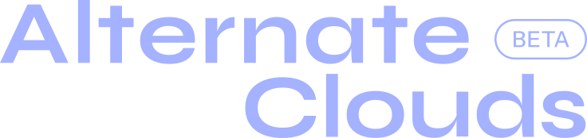

<div align="center">
  
</div>

# Alternate Clouds Documentation

Documentation site for the Alternate Clouds platform (docs.alternatefutures.ai).
Built with **Fumadocs** (Next.js, static export), deployed by Vercel from the
`main` branch (git integration; `vercel.json` serves `out/` as a static site).

- **Guides** - platform usage guides and tutorials (`content/docs/guides`)
- **CLI reference** - AUTO-GENERATED from the `alternate-clouds-cli` source
  (`scripts/generate-cli-docs.mjs` → `content/docs/cli/commands.mdx`)
- **SDK reference** - AUTO-GENERATED from `alternate-clouds-sdk` via TypeDoc
  (`scripts/generate-sdk-docs.mjs` → `content/docs/sdk/api.mdx`)
- **GraphQL API reference** - AUTO-GENERATED from the API server's schema
  (`scripts/generate-graphql-docs.mjs` → `content/docs/api/{queries,mutations,objects,inputs,enums}.mdx`)
- **Template catalog** - AUTO-GENERATED from the API server's template registry
  (`scripts/generate-template-docs.mjs` → `content/docs/templates/catalog.mdx`)
- **Drift lint** - `scripts/check-cli-drift.mjs` fails the build when a hand-written
  page types an `acc` command or flag the CLI no longer has
- **Agent-readable** - `/llms.txt` (platform context + index), `/llms-full.txt`
  (everything), a raw-markdown endpoint per page (`/llms.mdx/<path>/content.md`),
  and a **Copy for AI** button on every page that copies the page plus the
  platform context block from `lib/agent-context.ts`. Human guide: `/ai-agents`.
- **Style guide** - `STYLE.md` (Diátaxis groups, sentence-case titles, voice,
  agent-facing rules). Read before writing a page.

## Development

```bash
pnpm install
pnpm dev                 # dev server on :3000

pnpm generate:cli        # regenerate CLI reference (needs ../alternate-clouds-cli)
pnpm generate:sdk        # regenerate SDK reference (needs ../alternate-clouds-sdk)
pnpm generate:api        # regenerate GraphQL API reference (needs ../alternate-clouds-api)
pnpm generate:templates  # regenerate template catalog (needs ../alternate-clouds-api)
pnpm check:cli-drift     # lint hand-written pages against the CLI (needs ../alternate-clouds-cli)

pnpm build               # static export to out/
```

The generators locate sibling checkouts automatically; override with
`AF_CLI_REPO` / `AF_SDK_REPO` / `AF_API_REPO`.

## Structure

```
app/                # Next.js app (routing, layout, llms.txt endpoints)
content/docs/       # All documentation pages (MDX) + meta.json sidebars
scripts/            # reference generators (CLI, SDK, GraphQL API, templates) + CLI drift lint
public/             # Static assets (logos, icons)
```

## Deployment

**Vercel deploys `main`** on every push (`vercel.json`: `framework: null`,
build `pnpm run build`, output `out/`). Vercel runs only the Next.js build, so
the live site shows the **committed** CLI/SDK reference files.

Pushes to `develop`/`staging`/`main` also run
`.github/workflows/af-deploy-*.yml` → shared `af-deploy-common.yml`, which
checks out the CLI/SDK repos, regenerates the references, builds, uploads
`out/` as an artifact and, when the committed references are stale, commits
them to the branch (Vercel deploys) or, without `DOCS_BOT_TOKEN`, opens a pull
request. See `.github/workflows/README.md`.

**Merged to main is final.** Every ecosystem repo (CLI, web app, API, SDK)
has a `docs-update.yml` workflow that sends `repository_dispatch: docs-update`
here on push to `main`, so a merge anywhere republishes the docs without
clicks. The CLI's `npm-publish.yml` sends the same event after a release.

## Rules

- Never hand-edit a generated page (listed in `scripts/lib/generated-files.mjs`:
  `cli/commands.mdx`, `sdk/api.mdx`, `api/*.mdx` except `index`, `templates/catalog.mdx`)
  - they are overwritten by the generators on every merge to a source repo.
- The CLI binary is `acc` (`@alternatefutures/acc`). `af` is retired; pages in
  the "Legacy (retired af CLI)" sidebar section are kept for reference only.
